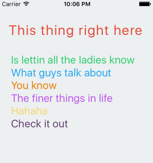

Thongs is a library for making NSAttributedString creation humane in Swift 3. 

[](https://travis-ci.org/tottakai/Thongs)
[](http://cocoapods.org/pods/Thongs)
[](http://cocoapods.org/pods/Thongs)
[](http://cocoapods.org/pods/Thongs)

## Usage

```swift
import Thongs

// Create a formatter by combining different attributes, such as font, color, kerning...
// then style the string with the formatter
let red = Thongs.color(UIColor(red: 231/255, green: 76/255, blue: 60/255, alpha: 1))
let large = Thongs.font(UIFont(name: "Avenir-Black", size: 28)!)
let kerning = Thongs.kerning(1.4)
let titleFormatter = red <*> large <*> kerning
titleLabel.attributedText = titleFormatter(Thongs.string("This thing right here"))


// combine string attributes with the <*> operator
// combine differently styled parts using the <+> operator
let bodyTextFontStyle1 = Thongs.font(UIFont(name: "Baskerville-SemiBoldItalic", size: 24)!)
let bodyTextFontStyle2 = Thongs.font(UIFont(name: "BradleyHandITCTT-Bold", size: 16)!)
let formatter1 = bodyTextFontStyle1 <*> Thongs.color(UIColor(red: 46/255, green: 204/255, blue: 113/255, alpha: 1))
let formatter2 = bodyTextFontStyle2 <*> Thongs.color(UIColor(red: 34/255, green: 167/255, blue: 240/255, alpha: 1))
let formatter3 = bodyTextFontStyle1 <*> Thongs.color(UIColor(red: 232/255, green: 126/255, blue: 4/255, alpha: 1))
let formatter4 = bodyTextFontStyle2 <*> Thongs.color(UIColor(red: 191/255, green: 85/255, blue: 236/255, alpha: 1))
let formatter5 = bodyTextFontStyle1 <*> Thongs.color(UIColor(red: 245/255, green: 215/255, blue: 110/255, alpha: 1))
let formattedLine = Thongs.font(UIFont(name: "Courier", size: 16)!) <*> Thongs.color(UIColor(red: 103/255, green: 65/255, blue: 114/255, alpha: 1)) ~~> "Check it out\n"

textBox.attributedText = formatter1 ~~> "Is lettin all the ladies know\n" <+>
        formatter2 ~~> "What guys talk about\n" <+>
        formatter3 ~~> "You know\n" <+>
        formatter4 ~~> "The finer things in life\n" <+>
        formatter5 ~~> "Hahaha\n" <+>
        formattedLine
```



Supports color, font, kerning, underline and strikethrough, but is easily extendable. Pull requests are welcome.

## Installation

Thongs is available through [CocoaPods](http://cocoapods.org). To install
it, simply add the following line to your Podfile:

```ruby
pod "Thongs"
```

## Author

Tomi Koskinen, tomi.koskinen@reaktor.fi 

## License

Thongs is available under the MIT license. See the LICENSE file for more info.
